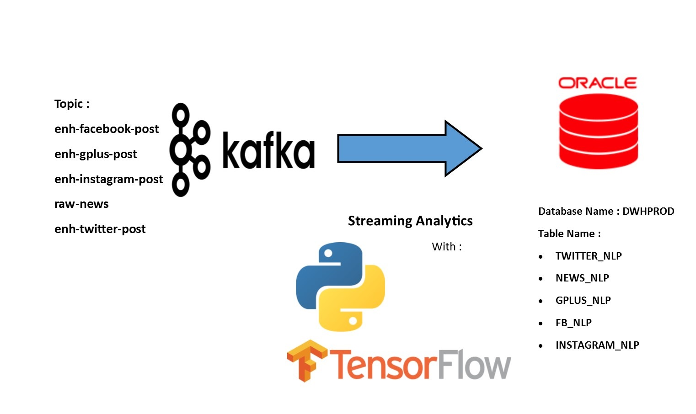
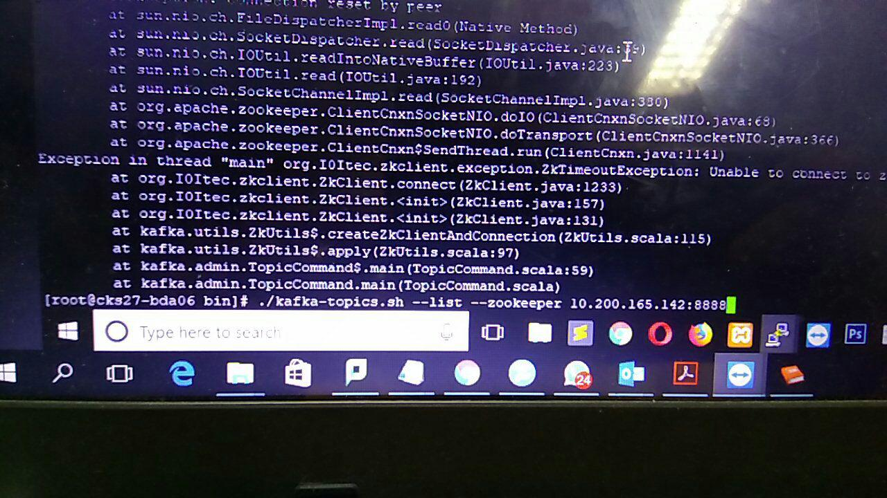
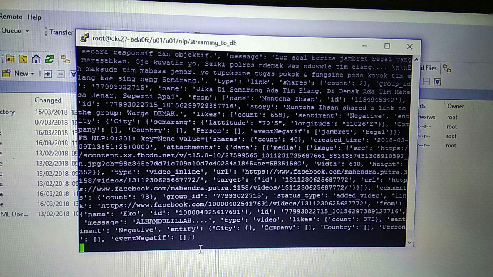
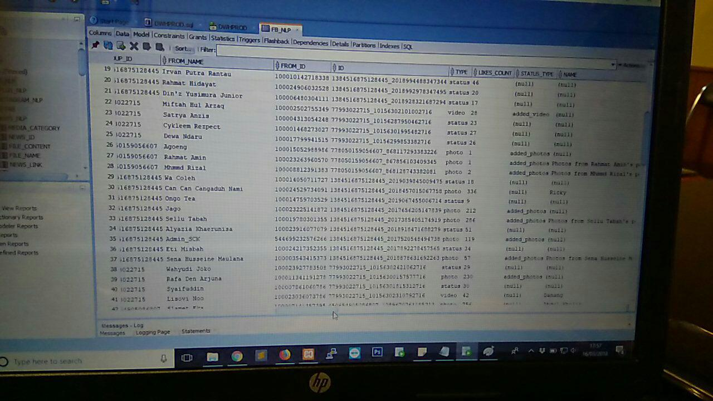
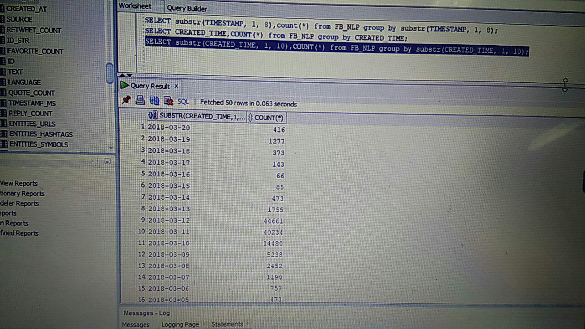
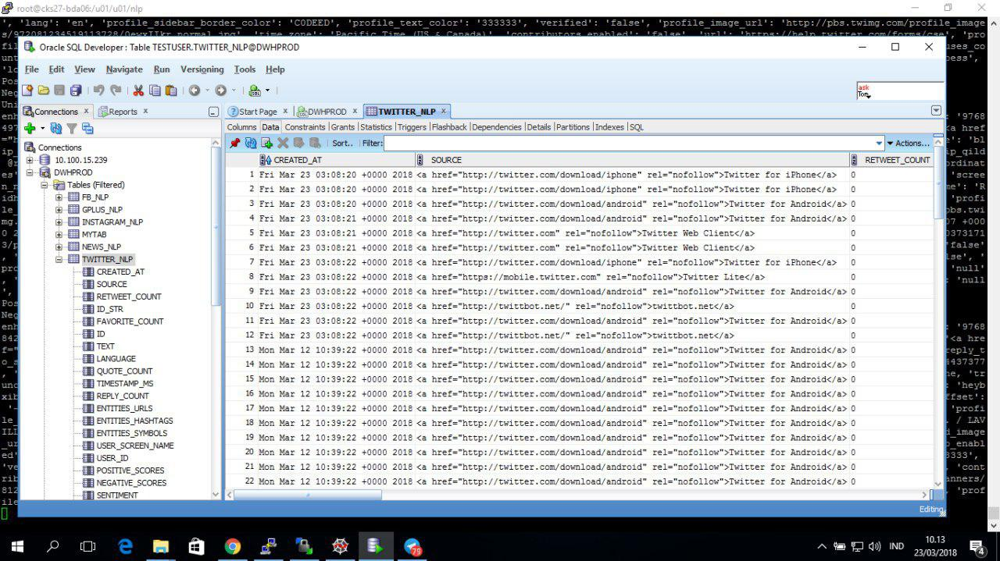

### Sentiment and Entity Analysis using Python and Connect to Oracle DB

I created this program when I have a POC about social media analytics. The client wants to analytic the streaming data from Kafka for each social media sources, likes Twitter, Instagram, Facebook, Gplus, and News. They want the data that has been analyzed to be stored in the Oracle database. So, i use the cx_Oracle which is a Python extension module that enables us to access the Oracle Database.

Script explanation :

- **fb_to_db.py** : Script for analyze sentiments and entities from Facebook, after that send the results to the Oracle database
- **twitter_to_db.py** : Script for analyze sentiments and entities from Twitter, after that send the results to the Oracle database
- **gplus_to_db.py** : Script for analyze sentiments and entities from Google Plus, after that send the results to the Oracle database
- **instagram_to_db.py** : Script for analyze sentiments and entities from Instagram, after that send the results to the Oracle database
- **news_to_db.py** : Script for analyze sentiments and entities from News, after that send the results to the Oracle database

Files explanation :
- **DataPreprocessing** : This script is for data preprocessing step before the datas will be analyzed (clean punctuations, symbols, lemmatization, normalize, etc)
- **dictionary.pickle** : This file is for knowing the number of index to find the Word2Vec models
- **final_embeddings.npy** : This file is the models of Word2Vec that have been created 
- **Location.txt** : This file contains the name of city and province in Indonesian with its longitude and lattitude
- **models** : The results of generate LSTM models for sentiment analysis

So, here are some examples of data consumed in Kafka and then analyzed using Python. Here kafka used is Confluent Kafka :
- Trying to find out what topics were available on Kafka

- Trying to save the results of the data that had been analyzed into Kafka before being sent to the Oracle database

After that, here are some examples of data that have been successfully stored in the Oracle database :
- Data from the analysis of comments on Facebook

- Trying to group the Facebook data by datetime

- Data from the analysis of comments on Twitter

So, all the Python scripts that I have been created are running on Linux environment and I created scheduling jobs so the scripts can running automatically.
